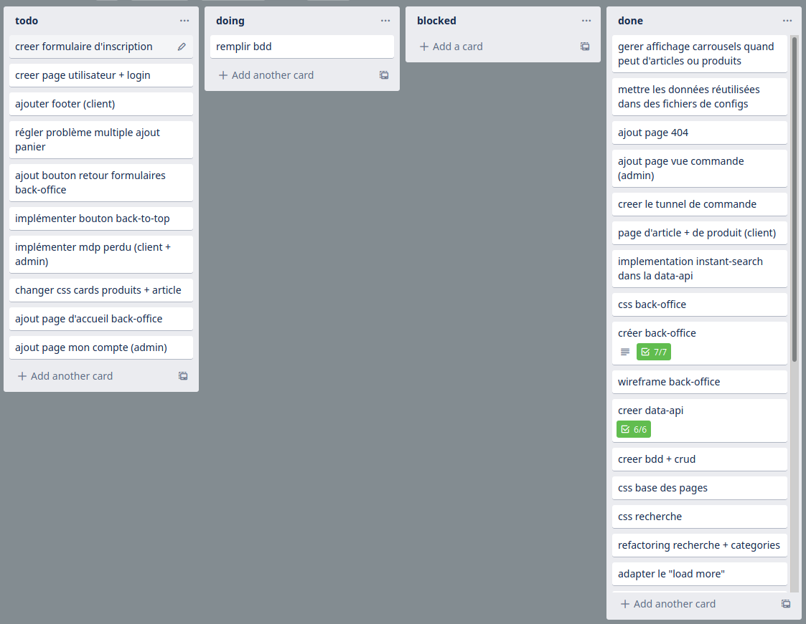
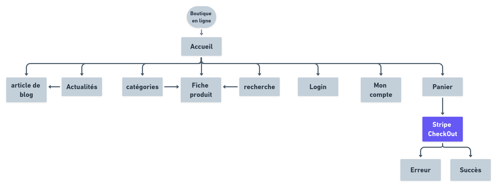
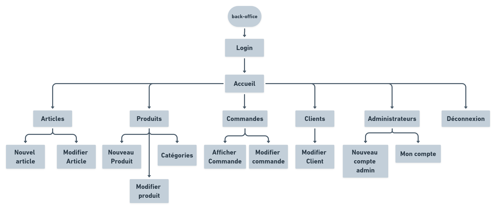

## Présentation Orale
### **Titre Professionnel Développeur Web et Web Mobile**

---
### Sommaire
@snap[midpoint span-100]
* #### I - Contexte du Projet
* #### II - Organisation du Travail
* #### III - Expression des Besoins
* #### IV - Conception
* #### V - Réalisations
@snapend
---

### I - Contexte du Projet
@snap[midpoint span-50]
@ul
- Pas de client
- Buts :
  - **Démonstration** de mes comptétences
  - **Décourverte** de nouveaux outils et frameworks
@ulend
@snapend
---
### II - Organisation du Travail
@snap[midpoint span-50]
@ul
- Modèle en **cascade**
- Suivit des tâches à réaliser avec **Trello**
@ulend
@snapend
---
### II - Organisation du Travail
@snap[south span-75]

@snapend
---
### III - Expression des Besoins
@snap[midpoint span-50]
@css[fragment](Trois sources de besoins) 
@ul
- Utilisateur
- Administrateurs
- Développeur
@ulend
@snapend
---
### III - Expression des Besoins
####  A - Besoins des utilisateurs
@snap[south span-70]
@ul
- Accès rapide aux **nouveautés**
- Navigation simple
- **Infos produits** simples et complètes
- Fonctionalitées de **recherche**
- **Panier** éditable et **paiement** sécurisé
- Adapté aux **smartphones**
@ulend
@snapend
---
### III - Expression des Besoins
####  B - Besoins des administrateurs
@snap[midpoint span-100]
@ul
- Interface **simple**
- Access **sécurisé** au back-office
@snapend
---
### III - Expression des Besoins
####  C - Besoins du développeur
@snap[midpoint span-70]
@ul
- Découvrir un **framework JS**
- Découvrir **Node.js**
- Intégrer des éléments **dynamiques** et **interactifs**
@snapend
---
### IV - Conception
@snap[midpoint span-70]
@css[fragment](Application en trois parties) 
@ul
- Front-end **boutique en ligne**
- Front-end **back-office**
- Back-end **API**
@snapend
---
### IV - Conception
#### A - Front-end boutique en ligne
@snap[midpoint span-70]
@ul
- Arborescence
- Wireframes
- Spécifications techniques
@snapend
---
### IV - Conception
#### A - Front-end boutique en ligne
@css[text-08](1 - Arborescence)
@snap[south span-100]

@snapend
---
### IV - Conception
#### A - Front-end boutique en ligne
@css[text-08](2 - Wireframes)

---
### IV - Conception
#### A - Front-end boutique en ligne
@css[text-08](2 - Wireframes - Accueil)
@snap[south span-100 height-65]


@snapend
---
### IV - Conception
#### A - Front-end boutique en ligne
@css[text-08](2 - Wireframes - Artcile de blog)
@snap[south span-100 height-65]

@snapend
---
### IV - Conception
#### A - Front-end boutique en ligne
@css[text-08](2 - Wireframes - categories et recherche)
@snap[south span-100 height-65]


@snapend
---
### IV - Conception
#### A - Front-end boutique en ligne
@css[text-08](2 - Wireframes - Fiche produit)
@snap[south span-100 height-65]


@snapend
---
### IV - Conception
#### A - Front-end boutique en ligne
@css[text-08](2 - Wireframes - Panier)
@snap[south span-100 height-65]


@snapend
---
### IV - Conception
#### A - Front-end boutique en ligne
@css[text-08](2 - Wireframes - Responsive desktop)
@snap[south span-100 height-65]

@snapend
---
### IV - Conception
#### A - Front-end boutique en ligne
@css[text-08](2 - Wireframes - Responsive desktop)
@snap[south span-100 height-65]

@snapend
---
### IV - Conception
#### A - Front-end boutique en ligne
@css[text-08](2 - Wireframes - Responsive desktop)
@snap[south span-100 height-65]

@snapend
---
### IV - Conception
#### A - Front-end boutique en ligne
@css[text-08](3 - Spécifications techniques)
@snap[south span-100]
@ul
- Framework React
- React Router
- React Alice Carousel
- Axios
- React InstantSearch + AlgoliaSearch
- Stripe
- use-cart, react-modal et react-markdown
@ulend
@snapend
---
### IV - Conception
#### B - Front-end back-office
@snap[midpoint span-70]
@ul
- Arborescence
- Spécifications techniques
@snapend
---
### IV - Conception
#### B - Front-end back-office
@css[text-08](1 - Arborescence)
@snap[south span-100]

@snapend
---
### IV - Conception
#### B - Front-end back-office
@css[text-08](2 - Spécifications techniques)
@snap[south span-100]
@ul
- Framework React
- React Router
- Axios
- Bulma
@ulend
@snapend
---
### IV - Conception
#### C - Back-end API
@snap[midpoint span-70]
@ul
- Base de données
- Spécifications techniques
@snapend
---
### IV - Conception
#### C - Back-end API
@css[text-08](1 - Base de données)
@snap[south span-100 height-65]

@snapend
---
### IV - Conception
#### C - Back-end API
@css[text-08](2 - Spécifications techniques)
@snap[south span-100]
@ul
- Framework Express
- Mongoose
- Body-parser
- helmet, cors, xss-clean, Bcrypt et JWT
- AlgoliaSearch et dotenv
@ulend
@snapend
---
### V - Réalisations
@snap[midpoint span-50]
@css[fragment](Un éxemple transversal :) 
@ul
- Gestion des **Produits**
@ulend
@snapend
---
### V - Réalisations
@snap[south span-100] 
@ul
- Modèle
- Contrôleur
- Routes
- Back-office
- Fiches produits
- Composant Card
- InstantSearch
@snapend
---
### V - Réalisations
#### A - Modèle
```jsx
const mongoose = require('mongoose')
const uniqueValidator = require('mongoose-unique-validator')

const productSchema = mongoose.Schema(
  {
    name: { type: String, required: true, unique: true },
    price: { type: Number, required: true },
    sale: { type: Number, required: true },
    imgSrc: { type: String, required: true },
    description: { type: String, required: true },
    categories: { type: String, required: true },
    brand: { type: String, required: true },
    tags: [String],
    stock: { type: Number, required: true },
    addDate: { type: Date, default: Date.now }
  }
)
productSchema.plugin(uniqueValidator)

module.exports = mongoose.model('Product', productSchema)
```
@[1-2, zoom-15]
@[4, zoom-15]
@[6-15, zoom-15]
@[18, zoom-15]
@[20, zomm-15]
---
### V - Réalisations
#### B - Contrôleur
```jsx fragment
const Product = require('../models/product')
require('dotenv').config('.env')

const algoliasearch = require('algoliasearch')
const client = algoliasearch(process.env.ALGOLIA_APPID, process.env.ALGOLIA_BACKENDAPI_KEY)
const index = client.initIndex('dev_projetFinal')

exports.getOneProduct = (req, res, next) => {
  Product.findOne({ _id: req.params.id })
    .then(product => res.status(200).json(product))
    .catch(
      error => {
        res.status(400).json({ error: error })
        console.log(error)
      }
    )
}
```
@[1, zoom-15]*
@[2, zoom-15]
@[4-6, zoom-15]
@[8, zoom-15]
@[9, zoom-15]
@[10, zoom-15]
@[11-14, zoom-15]
---
### V - Réalisations
#### B - Contrôleur
```jsx zoom-06
exports.createProduct = (req, res, next) => {
  const product = new Product({ ...req.body.product })
  product.save()
    .then(() => {
      const searchedProduct = {
        objectID: product._id,
        name: product.name,
        price: product.price,
        sale: product.sale,
        image: product.imgSrc,
        categories: product.categories,
        brand: product.brand,
        tags: product.tags,
        dispo: (product.stock > 0)
      }
      index.saveObject(searchedProduct)
      res.status(201).json({ message: 'Produit ajouté', objectId: product._id })
    })
    .catch(
      error => {
        res.status(400).json({ error: error })
        console.log(error)
      }
    )
}
```
@[1, zoom-15]
@[2, zoom-15]
@[3, zoom-15]
@[4-17, zoom-14]
@[19-22, zoom-15]
---
### V - Réalisations
#### C - Routes
```jsx fragment
const express = require('express')
const app = express()

const cors = require('cors')
const bodyParser = require('body-parser')
const xss = require('xss-clean')
const helmet = require('helmet')

const productRoutes = require('./routes/product')

app.use(helmet())
app.use(cors())
app.use(xss())

app.use('/product', bodyParser.json(), productRoutes)
```
@[1-2, zoom-15]
@[4-7, zoom-15]
@[9, zoom-15]
@[11-13, zoom-15]
@[15, zoom-15]
---
### V - Réalisations
#### C - Routes
```jsx
const express = require('express')
const router = express.Router()

const adminAuth = require('../middleware/adminAuth')

const productCtrl = require('../controllers/product')

router.post('/', adminAuth, productCtrl.createProduct)
router.get('/', productCtrl.getAllProduct)
router.get('/:id', productCtrl.getOneProduct)
router.get('/byName/:name', productCtrl.getOneProductByName)
router.get('/last/:n', productCtrl.getNLastProduct)
router.put('/:id', adminAuth, productCtrl.modifyProduct)
router.delete('/:id', adminAuth, productCtrl.deleteProduct)

module.exports = router
```
@[1-2, zoom-15]
@[4, zoom-15]
@[6, zoom-15]
@[8-14, zoom-14]
@[16, zoom-15]
---
### V - Réalisations
#### D - Back-office
@snap[midpoint span-100]
@ul
- Page Produits
- Composant productList
- Composant productForm
@snapend
---
### V - Réalisations
#### D - Back-office
@css[text-06](Page Produits)
```jsx fragment
const Products = () => {
  const path = useRouteMatch().path
  return (
    <>
      <ProductHeader />
      <div className='section'>
        <div className='container'>
          <h2 className='title is-2'>Gestion des produits</h2>
          <Switch>
            <Route exact path={path} key='list' component={ProductList} />
            <Route exact path={`${path}/new`} key='new' component={ProductForm} />
            <Route exact path={`${path}/modify/:id`} key='modify' component={ProductForm} />
            <Route exact path={`${path}/delete/:id`} component={ProductDel} />
            <Route exact path={`${path}/categories`} key='new' component={Categories} />
          </Switch>
        </div>
      </div>
    </>
  )
}
```
@[2, zoom-15]
@[5, zoom-15]
@[9-15, zoom-15]
---
### V - Réalisations
#### D - Back-office
@css[text-06](ProductList)
```jsx fragment
const [error, setError] = useState()
const [isLoaded, setIsLoaded] = useState(false)

const [products, setProducts] = useState()

useEffect(() => {
  axios.get(apiUrl + '/product')
    .then(
      res => {
        setProducts(res.data)
        setIsLoaded(true)
      },
      error => setError(error)
    )
}, [])
```
@[1-4, zoom-15]
@[6,15, zoom-15]
@[7-13, zoom-15]
---
### V - Réalisations
#### D - Back-office
@css[text-06](ProductList)
```jsx
{products.map(
  product =>
    <tr key={product.name}>
      <td>{product.name}</td>
      <td>{product.categories}</td>
      <td>{product.price}</td>
      <td>{product.sale}</td>
      <td>{product.stock}</td>
      <td>{new Date(product.addDate).toLocaleDateString('fr-FR')}</td>
      <td>
        <Link to={'/products/modify/' + product._id}>
          <span className='icon'>
            <FontAwesomeIcon icon={faEdit} />
          </span>
        </Link>
        <Link to={'/products/delete/' + product._id}>
          <span className='icon has-text-danger'>
            <FontAwesomeIcon icon={faTrash} />
          </span>
        </Link>
      </td>
    </tr>
)}
```
@[1, zoom-15]
@[3, zoom-15]
@[4-8, zoom-15]
@[9, zoom-15]
@[11-20, zoom-14]
---
### V - Réalisations
#### D - Back-office
@css[text-06](ProductForm)
```jsx text-06 fragment
const id = useParams().id
const [error, setError] = useState()
const [isPLoaded, setIsPLoaded] = useState(false)
const [isCLoaded, setIsCLoaded] = useState(false)
const [_product, setProduct] = useState()
const [categories, setCategories] = useState()

useEffect(() => {
    if (id) {
      axios.get(apiUrl + '/product/' + id)
        .then(
          res => {
            setProduct(res.data)
            setIsPLoaded(true)
          },
          error => setError(error)
        )
    }
    axios.get(apiUrl + '/category')
      .then(
        res => {
          setCategories(res.data)
          setIsCLoaded(true)
        },
        error => {
          setError(error)
        }
      )
  }, [id])

```
@[1-6, zoom-15]
@[8,29, zoom-15]
@[9, zoom-15]
@[10-16, zoom-15]
@[19-26, zoom-15]
---
### V - Réalisations
#### D - Back-office
@css[text-06](ProductForm)
```jsx text-06
const handleSubmit = (e) => {
  e.preventDefault()
  const form = e.target

  const product = {
    name: form[0].value,
    price: form[1].value,
    sale: form[2].value,
    imgSrc: form[3].value,
    description: form[4].value,
    brand: form[5].value,
    tags: form[6].value.split(','),
    categories: form[7].value,
    stock: form[8].value
  }

  axios.post(apiUrl + '/product/', { product })
    .then(
      res => window.location.assign('/products'),
      error => setError(error)
    )
}
```
@[2, zoom-15]
@[3, zoom-15]
@[5-14, zoom-15]
@[17-20, zoom-15]
---
### V - Réalisations
#### E - Fiches produits
```jsx zoom-12 fragment 
const { name } = useParams()

useEffect(() => {
    axios.get(apiUrl + '/product/byName/' + name)
      .then(
        res => {
          setProduct(res.data)
          setIsLoaded(true)
        },
        error => setError(error)
      )
  }, [name])
```
---
### V - Réalisations
#### F - Composant Card
```jsx fragment
  {(product.sale !== 0) ? (
    <>
      <p className='oldPrice'>
        {
          new Intl.NumberFormat('fr-FR', { style: 'currency', currency: 'EUR' })
            .format(product.price)
        }
      </p>
      <p className='price'>
        {
          new Intl.NumberFormat('fr-FR', { style: 'currency', currency: 'EUR' })
            .format(reducedPrice)
        }
      </p>
    </>
  ) : (
    <p className='price'>
      {
        new Intl.NumberFormat('fr-FR', { style: 'currency', currency: 'EUR' })
          .format(product.price)
      }
    </p>
  )}
```
---
### V - Réalisations
#### G - InstantSearch
@css[text-06](Composant Search)
```jsx fragment
const searchClient = algoliasearch('H2YGA5NBNG', '26b1badfb8cb68a219e300f7cd17df1e')
const [searchState, setSearchState] = useState({})
const [isModalOpen, setIsModalOpen] = useState(false)
const onSearchStateChange = newSearchState => {
  setSearchState(oldSearchState => { return { ...oldSearchState, ...newSearchState } })
}
<InstantSearch
  searchClient={searchClient}
  indexName='dev_projetFinal'
  onSearchStateChange={onSearchStateChange}
  searchState={searchState}
>
  //elements de recherche
</InstantSearch>
}
```
---
### V - Réalisations
#### G - InstantSearch
@css[text-06](Composant Search)
```jsx text-06
{
  category
    ? (
      <Configure filters={'categories:"' + category + '"'} hitsPerPage={24} />
    ) : (
      <SearchBox />
    )
}
<div className='buttons'>
  <button onClick={() => setIsModalOpen(true)}>
    Filtrer&nbsp;
    <FontAwesomeIcon icon={faSlidersH} />
  </button>
  <SortBy
    items={[
      { value: 'dev_projetFinal', label: 'Nom' },
      { value: 'dev_price_asc', label: 'Prix asc' },
      { value: 'dev_price_desc', label: 'Prix desc' },
      { value: 'dev_sale', label: 'Promotions' }
    ]}
    defaultRefinement='dev_projetFinal'
  />
</div>
```
@[2-7, zoom-15]
@[10-13, zoom-15]
@[14-22, zoom-15]
---
### V - Réalisations
#### G - InstantSearch
@css[text-06](Composant Search)
```jsx
<CurrentRefinements />
<MyInfiniteHits />

<Filters
  setIsOpen={setIsModalOpen}
  isOpen={isModalOpen}
  onSearchStateChange={onSearchStateChange}
  searchState={searchState}
  searchClient={searchClient}
  withCategories={!category}
/>
```
@[1, zoom-15]
@[2, zoom-15]
@[4, zoom-15]
---
### V - Réalisations
#### G - InstantSearch
@css[text-06](Composant MyInfiniteHits)
```jsx fragment
const InfiniteHits = ({ hits, hasPrevious, hasMore, refinePrevious, refineNext }) => {
  const handleScroll = () => {
    var scrollHeight = document.body.scrollHeight
    var scrollPosition = window.scrollY + window.innerHeight
    if (hasMore && ((scrollHeight - 370) <= scrollPosition)) {
      refineNext()
    }
  }

  useEffect(() => {
    window.addEventListener('scroll', handleScroll)
    return () => window.removeEventListener('scroll', handleScroll)
  })

  return (
    //affichage du contenu de hits
  )

  const MyInfiniteHits = connectInfiniteHits(InfiniteHits)
```
---
### V - Réalisations
#### G - InstantSearch
@css[text-06](Composant Filters)
```jsx fragment
const VirtualRefinementList0 = connectRefinementList(() => null)
const VirtualRefinementList1 = connectRefinementList(() => null)
const VirtualRefinementList2 = connectRefinementList(() => null)
const VirtualRange = connectRange(() => null)
const Filters = ({ withCategories, searchClient, searchState, onSearchStateChange, isOpen, setIsOpen }) => {
  return (
    <>
      <VirtualRefinementList0 attribute='brand' />
      {withCategories && <VirtualRefinementList1 attribute='categories' />}
      <VirtualRefinementList2 attribute='tags' />
      <VirtualRange attribute='price' />
      <ReactModal
        isOpen={isOpen}
        onRequestClose={() => setIsOpen(false)}
      >
        // contenu de la modale
      </ReactModal>
    </>
  )
}

```
---
### VI - Synthèse et Conclusions
---